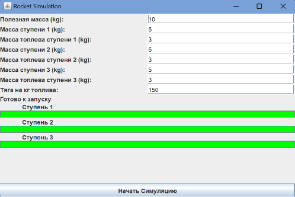
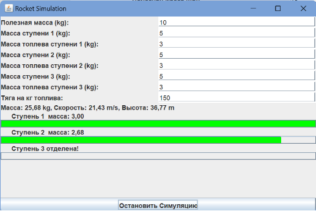
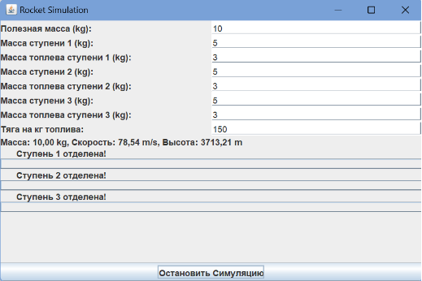



**Лабораторная работа №4**

**по дисциплине «Инжиниринг программного обеспечения»**

Модель с подпиской на события

Факультет: АВТФ

Группа: АВТ-141

Студенты: Кенин Е.Д., Половин Н.В.

Вариант: 9

Преподаватель: Романов Е.Л.

**Содержание**

[1.	Описание работы	3](#_toc179747872)

[2.	Описание паттернов	4](#_toc179747873)

[3.	Функциональное описание классов	5](#_toc179747874)

[4.	Результаты работы	10](#_toc179747875)

[5.	Вывод	11](#_toc179747876)

# **1.Описание работы**
Класс-контроллер реализует в отдельном потоке в реальном времени модель поведения физического объекта или системы. Классы GUI (формы) получают ссылку на объект-контроллер с интерфейсом команд и подписываются на получение от него периодических данных и событий через соответствующий интерфейс (шаблон наблюдатель). При появлении в контроллере события последний вызывает соответствующий метод во всех подписанных объектах. При закрытии объекта класса GUI он отписывается от контроллера. События и команды в интерфейсах должны обеспечивать объектам внешнего представления полный набор возможностей управления и отображения состояния физического объекта. При тестировании в качестве подписчика на события можно использовать:

•	графический элемент GUI, разработанный в л.р.3;

•	подходящие элемент GUI других бригад;

•	библиотеки для построения графиков;

•	экспорт данных в Excel и построение на их основе элементов визуализации.

Моделирование взлета 3-ступечатой ракеты-носителя. Задана масса выводимого аппарата, каждая ступень имеет собственный вес, вес топлива, силу тяги. Задан показатель – сила тяги на 1 кг веса топлива.  Сила тяги ступени постоянна и превышает вес оставшихся ступеней на момент начала работы. Отделение ступени на момент исчерпания топлива. CallBack  по событиям отделения ступени, периодическое событие – текущее состояние: количество ступеней, масса, скорость, высота от точки старта.

 # **2.Описание паттернов**
В данном приложении используются следующие паттерны проектирования:

**MVC (Model-View-Controller):**

**Model (Модель):** RocketModel содержит логику симуляции ракеты, хранит параметры и обновляет состояние. Это сердце приложения, которое обрабатывает бизнес-логику и вычисления.

**View (Представление):** RocketGUI отображает интерфейс пользователя и предоставляет визуализацию состояния ракеты. GUI отвечает за ввод данных от пользователя и отображение текущего состояния.

**Controller (Контроллер):** RocketController управляет взаимодействием между моделью и представлением. Он получает команды от интерфейса и передает их в модель для выполнения.

**Паттерн "Наблюдатель" (Observer):** RocketModel реализует этот паттерн для оповещения всех зарегистрированных наблюдателей (объекты типа RocketObserver) о изменениях состояния ракеты. RocketGUI подписывается на модель как наблюдатель, и обновляет GUI (например, прогресс-бары для топлива) при изменении состояния ракеты. Модель вызывает метод notifyObservers(), который оповещает все зарегистрированные наблюдатели о новом состоянии**.**

**Паттерн "Команда" (Command):** Интерфейс RocketControl и его реализация RocketController используют паттерн "Команда". Методы startSimulation(), stopSimulation(), setRocketParameters() инкапсулируют действия, которые можно вызвать на модели. Это помогает отделить логику управления ракетой от ее интерфейса.

**Паттерн "Стратегия" (Strategy):** Паттерн "Стратегия" используется в некотором смысле через передачу параметров ракеты (например, массы полезного груза, массы ступеней, топлива и тяги) в методе setRocketParameters(). Это позволяет легко настраивать параметры модели, не изменяя саму логику симуляции.
# **3.Функциональное описание классов**
В программе используется 7 классов: App, BoundaryComparator, Controller, DataGraph, LevelIndicator, Model, View.

1. **Main**

Описание класса: Главный класс, точка входа программы, которая запускает симуляцию ракеты и инициализирует взаимодействие между моделью, контроллером и графическим интерфейсом.

Методы:

***main(String[] args):*** Главный метод программы. Создает объекты модели, контроллера и интерфейса пользователя, связывает их между собой и запускает приложение.

1. **RocketModel**

Описание класса: Модель ракеты, которая хранит и обновляет текущее состояние ракеты во время симуляции (масса, скорость, высота и топливо). Также отвечает за расчет физических параметров полета.

Переменные:

***double payloadMass:*** Масса полезной нагрузки.

***double[] stageMasses:*** Массив масс ступеней ракеты.

***double[] fuelMasses:*** Массив оставшегося топлива в каждой ступени.

***double[] initialFuelMasses:*** Массив начальных масс топлива для каждой ступени.

***double thrustPerKgFuel:*** Тяга на килограмм топлива.

***double currentMass:*** Текущая масса ракеты (полезная нагрузка + оставшиеся ступени).

***double speed:*** Текущая скорость ракеты.

***double altitude:*** Текущая высота ракеты.

***int remainingStages:*** Количество оставшихся ступеней ракеты.

***boolean running:*** Флаг, указывающий, запущена ли симуляция.

***List<RocketObserver> observers:*** Список наблюдателей для уведомления о изменениях состояния ракеты.

Методы:

***startSimulation():*** Запускает симуляцию ракеты в отдельном потоке.

***stopSimulation():*** Останавливает текущую симуляцию.

***updateRocketState():*** Обновляет физическое состояние ракеты на каждом шаге симуляции (включая высоту, скорость и расход топлива).

***simulatePayloadFlight():*** Обновляет состояние полета полезной нагрузки после отделения последней ступени.

***addObserver(RocketObserver observer):*** Добавляет наблюдателя, который будет получать обновления о состоянии ракеты.

***removeObserver(RocketObserver observer):*** Удаляет наблюдателя.

***notifyObservers():*** Уведомляет всех зарегистрированных наблюдателей о текущем состоянии ракеты.

***separateStage():*** Отделяет текущую ступень ракеты и уведомляет наблюдателей.

***calculateGravity(double altitude):*** Рассчитывает силу тяжести на данной высоте над поверхностью Земли.

***setRocketParameters(double payloadMass, double[] stageMasses, double[] fuelMasses, double thrustPerKgFuel):*** Устанавливает начальные параметры ракеты (полезная нагрузка, ступени, топливо и тяга).

1. **RocketController**

Описание класса: Контроллер, который связывает графический интерфейс и модель. Получает команды от интерфейса и передает их в модель для выполнения.

Переменные:

***RocketModel model:*** Объект модели ракеты, с которым работает контроллер.

Методы:

***RocketController(RocketModel model):*** Конструктор, инициализирующий контроллер с моделью.

***startSimulation():*** Запускает симуляцию, вызывая соответствующий метод модели.

***stopSimulation():*** Останавливает симуляцию, вызывая соответствующий метод модели.

***setRocketParameters(double payloadMass, double[] stageMasses, double[] fuelMasses, double thrustPerKgFuel):*** Устанавливает параметры ракеты в модели.

1. **RocketGUI**

Описание класса: Интерфейс пользователя для управления симуляцией ракеты. Содержит элементы управления и визуализации состояния ракеты (например, прогресс-бары для топлива и кнопки для запуска/остановки симуляции).

Переменные:

***RocketController controller:*** Контроллер для управления моделью ракеты.

***JProgressBar[] fuelBars:*** Прогресс-бары для отображения уровня топлива на каждой ступени.

***JLabel[] fuelLabels:*** Метки для отображения статуса каждой ступени.

***JLabel statusLabel:*** Метка для отображения статуса симуляции.

***JTextField payloadMassField:*** Поле для ввода массы полезной нагрузки.

***JTextField[] stageMassFields:*** Поля для ввода массы каждой ступени.

***JTextField[] fuelMassFields:*** Поля для ввода количества топлива на каждой ступени.

***JTextField thrustField:*** Поле для ввода тяги на килограмм топлива.

***JButton startStopButton:*** Кнопка для запуска и остановки симуляции.

***boolean isSimulating:*** Флаг для отслеживания состояния симуляции.

Методы:

***RocketGUI(RocketController controller):*** Конструктор, создающий и настраивающий графический интерфейс.

***initUI():*** Инициализирует компоненты интерфейса пользователя и добавляет их в окно.

***startSimulation():*** Читает параметры, вводимые пользователем, передает их в контроллер и запускает симуляцию.

***stopSimulation():*** Останавливает симуляцию через контроллер и обновляет интерфейс.

***validateInputs():*** Проверяет корректность введенных данных.

***onStageSeparation(int stageNumber):*** Обрабатывает событие отделения ступени и обновляет интерфейс.

***onUpdateStatus(double currentMass, double speed, double altitude, int remainingStages, double[] fuelMasses, double[] initialFuelMasses):*** Обновляет отображение статуса ракеты и визуальные компоненты интерфейса.

1. **RocketObserver**

Описание класса: Интерфейс наблюдателя, который должен реализовывать класс, подписывающийся на изменения в модели ракеты.

Методы:

***onStageSeparation(int stageNumber):*** Вызывается при отделении ступени.

***onUpdateStatus(double currentMass, double speed, double altitude, int remainingStages, double[] fuelMasses, double[] initialFuelMasses):*** Вызывается при обновлении состояния ракеты (масса, скорость, высота и количество ступеней).

1. **RocketControl**

Описание класса: Интерфейс для команд, которые контроллер может выполнять для управления ракетой.

Методы:

***startSimulation():*** Запуск симуляции ракеты.

***stopSimulation():*** Остановка симуляции ракеты.

***setRocketParameters(double payloadMass, double[] stageMasses, double[] fuelMasses, double thrustPerKgFuel):*** Установка параметров ракеты.

# **4.Результаты работы**

Рисунок 1. Запуск приложения.

Рисунок 3. Процесс симуляции.

Рисунок 3. Результат взлёта ракеты при данных настройках.

# **5.Вывод**
В ходе выполнения поставленной задачи был разработан класс для моделирования взлёта трёхступенчатой ракеты-носителя с учётом изменения силы притяжения Земли в зависимости от высоты полёта. Класс RocketModel реализует основные физические формулы и принципы, включая закон всемирного тяготения и динамику изменения массы ракеты при расходе топлива и отделении ступеней.

Модель обладает функциональностью настройки параметров ракеты, таких как масса полезной нагрузки, массы ступеней, массы топлива и удельная тяга на 1 кг топлива. Реализована поддержка динамического обновления состояния ракеты в реальном времени, включая расчёт текущей скорости, высоты и ускорения с учётом гравитационного ускорения, изменяющегося с высотой.

Класс продолжает моделирование даже после отделения последней ступени, позволяя анализировать движение полезной нагрузки под действием гравитации. Используется паттерн "Наблюдатель" для уведомления подключённых объектов о изменениях состояния ракеты, что обеспечивает гибкость в отображении и обработке полученных данных.

Таким образом, разработанный класс обеспечивает точное и динамическое моделирование полёта ракеты-носителя с возможностью гибкой настройки параметров и детального отслеживания критических состояний, таких как расход топлива, отделение ступеней и изменение силы притяжения. 
2

